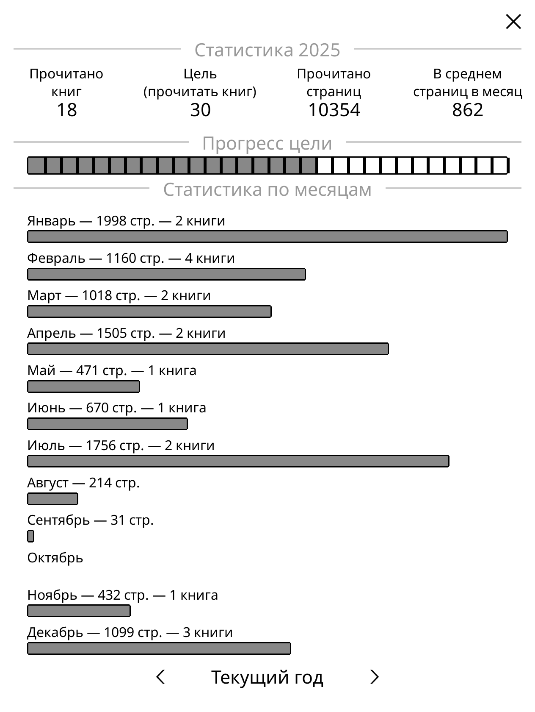

# Book statistics

It is a plugin for [KOReader](https://github.com/koreader/koreader) application that enhances the possibilitees of reading statistics tracking in KOReader.

Mainly it allows tracking of the dates when books were finished. It also creates a new yearly progress view showing you how many books and pages you read in a year and by month.

It is already mostly functional, but still work in progress. Also I don't know how to translate it, so most strings are in Russian for now.